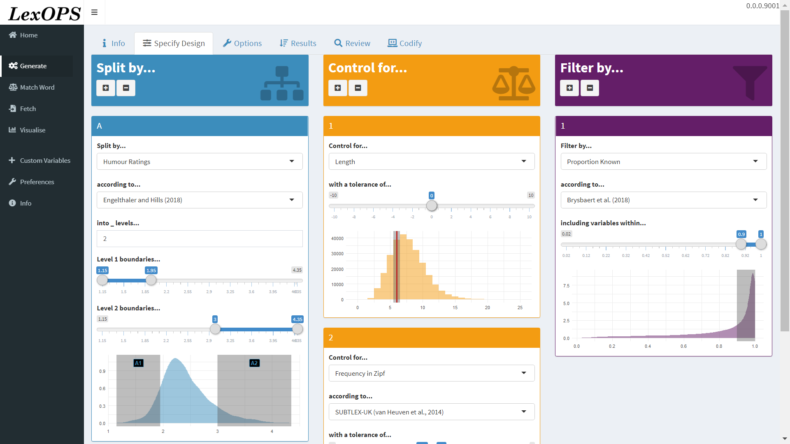

<!-- README.md is generated from README.Rmd. Please edit that file -->

# LexOPS 

<!-- badges: start -->

[](https://www.tidyverse.org/lifecycle/#stable)
[](https://github.com/JackEdTaylor/LexOPS/releases)
[](https://doi.org/10.3758/s13428-020-01389-1)
<!-- badges: end -->

LexOPS is an R package for generating matched stimuli for factorial
design experiments. You can use the functions on any dataframe, but
there is an inbuilt database of example features for English words for
psycholinguistics studies in English (`LexOPS::lexops`).

## Installation

LexOPS can be installed as an R package with:

``` r
if (!require("devtools")) install.packages("devtools")
devtools::install_github("JackEdTaylor/LexOPS@*release")
```

## How to Use

:book: In-depth walkthrough of the package:
<https://jackedtaylor.github.io/LexOPSdocs/>

:mortar\_board: Paper about the package: [Taylor, Beith, and Sereno
(2020)](https://doi.org/10.3758/s13428-020-01389-1)

## TL;DR

LexOPS makes it easy to generate matched stimuli in a reproducible way.

### The “Generate Pipeline”

The following example pipeline generates 50 words (all nouns) per
condition (200 words in total), for a study with a 2 x 2, concreteness
(low, high) by bigram probability (low, high) experimental design. Words
are controlled for by length exactly, and by word frequency within a
tolerance of ±0.2 Zipf.

``` r
library(LexOPS)

# generate stimuli
stim <- lexops %>%
  subset(PoS.SUBTLEX_UK == "noun") %>%
  split_by(BG.SUBTLEX_UK, 0.001:0.004 ~ 0.008:0.011) %>%
  split_by(CNC.Brysbaert, 1:2 ~ 4:5) %>%
  control_for(Zipf.SUBTLEX_UK, -0.2:0.2) %>%
  control_for(Length) %>%
  generate(n = 50, match_null = "balanced")
```

    #> Generated 5/50 (10%). 6 total iterations, 0.83 success rate.
    #> Generated 10/50 (20%). 12 total iterations, 0.83 success rate.
    #> Generated 15/50 (30%). 19 total iterations, 0.79 success rate.
    #> Generated 20/50 (40%). 27 total iterations, 0.74 success rate.
    #> Generated 25/50 (50%). 39 total iterations, 0.64 success rate.
    #> Generated 30/50 (60%). 46 total iterations, 0.65 success rate.
    #> Generated 35/50 (70%). 52 total iterations, 0.67 success rate.
    #> Generated 40/50 (80%). 84 total iterations, 0.48 success rate.
    #> Generated 45/50 (90%). 100 total iterations, 0.45 success rate.
    #> Generated 50/50 (100%). 117 total iterations, 0.43 success rate.

A preview of what was generated:

``` r
# create a table of the first 20 words (4 per row) as an example
stim %>%
  head(5) %>%
  knitr::kable()
```

| item\_nr | A1\_B1       | A1\_B2       | A2\_B1       | A2\_B2       | match\_null |
| -------: | :----------- | :----------- | :----------- | :----------- | :---------- |
|        1 | smugness     | dumbbell     | monotony     | fastener     | A1\_B2      |
|        2 | gracefulness | spectrograph | predominance | thundercloud | A1\_B1      |
|        3 | purpose      | cricket      | version      | chamber      | A1\_B1      |
|        4 | imprudence   | plexiglass   | creepiness   | cowcatcher   | A1\_B1      |
|        5 | agoraphobia  | brushstroke  | insinuation  | parishioner  | A2\_B1      |

### Review Generated Stimuli

The `plot_design()` function produces a plot summarising the generated
stimuli.

``` r
plot_design(stim)
```


### Convert to Long Format

The `long_format()` function coerces the generated stimuli into long
format.

``` r
# present the same 20 words as in the last table
long_format(stim) %>%
  head(20) %>%
  knitr::kable()
```

| item\_nr | condition | match\_null | string       | Zipf.SUBTLEX\_UK | Length | BG.SUBTLEX\_UK | CNC.Brysbaert |
| -------: | :-------- | :---------- | :----------- | ---------------: | -----: | -------------: | ------------: |
|        1 | A1\_B1    | A1\_B2      | smugness     |         2.339188 |      8 |      0.0033250 |          1.96 |
|        1 | A1\_B2    | A1\_B2      | dumbbell     |         2.394706 |      8 |      0.0034583 |          4.69 |
|        1 | A2\_B1    | A1\_B2      | monotony     |         2.403306 |      8 |      0.0082586 |          1.79 |
|        1 | A2\_B2    | A1\_B2      | fastener     |         2.329204 |      8 |      0.0096918 |          4.10 |
|        2 | A1\_B1    | A1\_B1      | gracefulness |         1.774917 |     12 |      0.0035692 |          1.86 |
|        2 | A1\_B2    | A1\_B1      | spectrograph |         1.649978 |     12 |      0.0026646 |          4.00 |
|        2 | A2\_B1    | A1\_B1      | predominance |         1.974489 |     12 |      0.0087761 |          1.56 |
|        2 | A2\_B2    | A1\_B1      | thundercloud |         1.695736 |     12 |      0.0098056 |          4.52 |
|        3 | A1\_B1    | A1\_B1      | purpose      |         4.511181 |      7 |      0.0032840 |          1.52 |
|        3 | A1\_B2    | A1\_B1      | cricket      |         4.452220 |      7 |      0.0039900 |          4.77 |
|        3 | A2\_B1    | A1\_B1      | version      |         4.536782 |      7 |      0.0090194 |          1.70 |
|        3 | A2\_B2    | A1\_B1      | chamber      |         4.391917 |      7 |      0.0085878 |          4.59 |
|        4 | A1\_B1    | A1\_B1      | imprudence   |         1.297796 |     10 |      0.0034965 |          1.60 |
|        4 | A1\_B2    | A1\_B1      | plexiglass   |         1.297796 |     10 |      0.0035633 |          4.42 |
|        4 | A2\_B1    | A1\_B1      | creepiness   |         1.473887 |     10 |      0.0082210 |          1.61 |
|        4 | A2\_B2    | A1\_B1      | cowcatcher   |         1.172857 |     10 |      0.0093999 |          4.33 |
|        5 | A1\_B1    | A2\_B1      | agoraphobia  |         2.252038 |     11 |      0.0033591 |          1.92 |
|        5 | A1\_B2    | A2\_B1      | brushstroke  |         2.038158 |     11 |      0.0038485 |          4.27 |
|        5 | A2\_B1    | A2\_B1      | insinuation  |         2.127099 |     11 |      0.0093339 |          1.63 |
|        5 | A2\_B2    | A2\_B1      | parishioner  |         2.275519 |     11 |      0.0089277 |          4.04 |

### Shiny App

The package has an interactive shiny app, which supports most code
functionality, with useful additional features like visualising
distributions and relationships. It’s a friendly front-end to the
package’s functions. A demo version of the LexOPS shiny app is available
online at <https://jackt.shinyapps.io/lexops/>, but it is faster and
more reliable to run it locally, with:

``` r
LexOPS::run_shiny()
```


